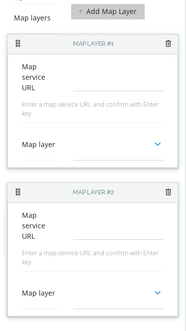
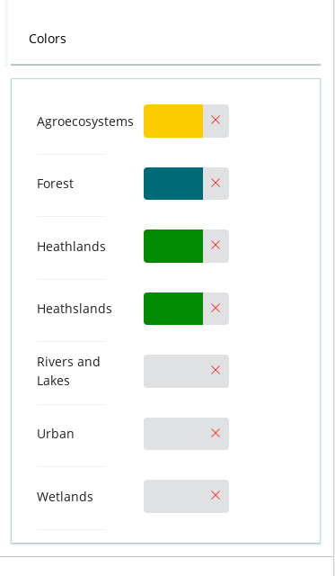
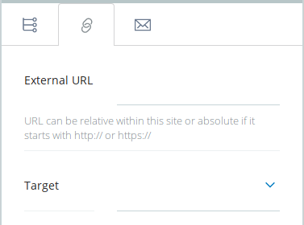

# volto-object-widget
[](https://github.com/eea/volto-object-widget/releases)
[](https://ci.eionet.europa.eu/view/Github/job/volto-addons/job/volto-object-widget/job/master/display/redirect)
[](https://ci.eionet.europa.eu/view/Github/job/volto-addons/job/volto-object-widget/job/develop/display/redirect)

[Volto](https://github.com/plone/volto) add-on

## Features

This Volto addon provides several "abstract" widgets, to allow complex
information to be editable by the schema-based forms. It centers around the
concept: "we can create a form to edit a JSON object by using a schema" and so
it provides, right now, widgets to edit "list of JSON objects", a "mapping of
JSON objects" and a single "JSON object, but I choose the schema for it".

### FlatListObject



This widget allows you to edit a list of objects by creating, editing and
deleting instances of objects editable with the provided `schema` parameter.
The list is sortable with drag&drop. You can also provide a schema extender,
a function with signature `(schema, data) => schema`, which will adjust, per
instance of object, its schema. To use this widget, in the schema, set the
`widget` field to `object_list_inline`.

Example of how the data could look like for a block:

```
"a55c5053-ba81-4f73-ab29-7cdea74df20f": {
	"@type": "dataTable",
	"columns": [
		{
			"@id": "f899ca76-68be-4ded-aa0b-669c04c27309",
			"column": " PERC_HA_07\n(in %)",
			"renderer": "progress",
			"title": "21"
		},
		{
			"@id": "94315c5a-e031-4b7e-acb2-93887878a252",
			"column": " PERC_HA_07\n(in %)",
			"title": "12"
		}
	],
}
```

The `columns` field, in this case, is data generated by the `FlatListObject`.
The schema for this field could look like (`ColumnSchema()` just generates
another instance of a schema, suitable for the `column` definition of our
specific use case):

```
columns: {
  title: 'Columns',
  description: 'Leave empty to show all columns',
  schema: ColumnSchema(),
  widget: 'object_list_inline',
},
```

### Mapping Widget



This widget allows editing the properties of an object. For example, in the
following block data, the `row_colors` value is generated by an instance of the
`MappingWidget`.

```
"4430a32a-a266-497b-88e7-72fead5ab718": {
  "@type": "dottedTableChart",
  "column_data": "habitat_group",
  "row_colors": {
    "Bad": "#ed1834",
    "F - Heathland, scrub and tundra": "#88c24f",
    "Good": "#3c8000",
    "Poor": "#f2a70e",
    "Unknown": "#8d8d8d"
  },
  "row_data": "assessment",
  "size_data": "quantity"
},
```

You need to provide the `options`, which is a list of objects with `{id, title}` and the `field_props`, which are parameters for the actual field that
will be used to edit the values. In our case the schema definition that was
used to edit the above value is (note, the options are empty, we're populating
them in the edit component, before passing the schema to the form):

```
row_colors: {
  title: 'Colors',
  widget: 'option_mapping',
  field_props: {
    widget: 'simple_color',
    available_colors: settings.available_colors,
  },
  options: [],
}
```

To use this widget, in the schema, set the `widget` field to `option_mapping`.

### Object by type



With this widget you can choose the type of value that will be used, from
a predefined list of schemas. A schema that would use this type of widget could
look like:

```
const LinkEditSchema = {
  title: 'Link',
  fieldsets: [
    {
      id: 'default',
      title: 'Default',
      fields: ['link'],
    },
  ],
  properties: {
    link: {
      title: 'Link',
      widget: 'object_by_type',
      schemas: [
        {
          id: 'internal',
          icon: internalSVG,
          schema: InternalLinkSchema,
        },
        {
          id: 'external',
          icon: externalSVG,
          schema: ExternalLinkSchema,
        },
        {
          id: 'email',
          icon: emailSVG,
          schema: EmailLinkSchema,
        },
      ],
    },
  },
  required: [],
};
```

To use this widget, in the schema, set the `widget` field to `object_by_type`.

## Getting started

1. Create new volto project if you don't already have one:

   ```
   $ npm install -g yo @plone/generator-volto
   $ yo @plone/volto my-volto-project --addon @eeacms/volto-object-widget

   $ cd my-volto-project
   $ yarn add -W @eeacms/volto-object-widget
   ```

1. If you already have a volto project, just update `package.json`:

   ```JSON
   "addons": [
       "@eeacms/volto-object-widget"
   ],

   "dependencies": {
       "@eeacms/volto-object-widget": "^1.0.0"
   }
   ```

1. Install new add-ons and restart Volto:

   ```
   $ yarn
   $ yarn start
   ```

1. Go to http://localhost:3000

1. Happy editing!


## How to contribute

See [DEVELOP.md](https://github.com/eea/volto-object-widget/blob/master/DEVELOP.md).

## Copyright and license

The Initial Owner of the Original Code is European Environment Agency (EEA).
All Rights Reserved.

See [LICENSE.md](https://github.com/eea/volto-object-widget/blob/master/LICENSE.md) for details.

## Funding

[European Environment Agency (EU)](http://eea.europa.eu)
